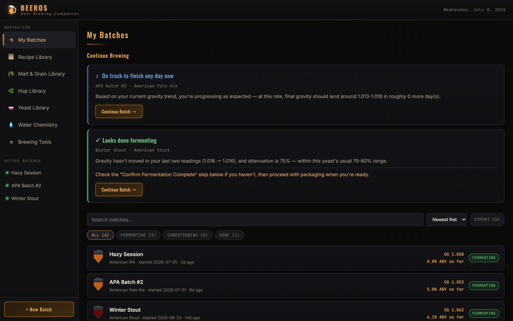
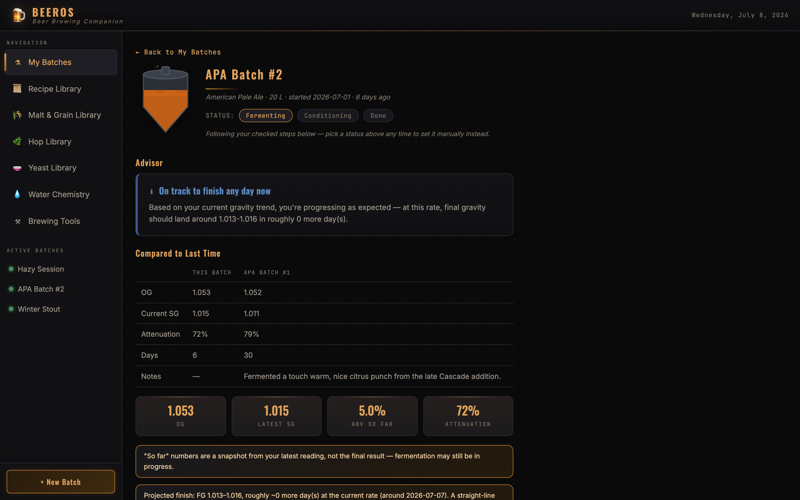
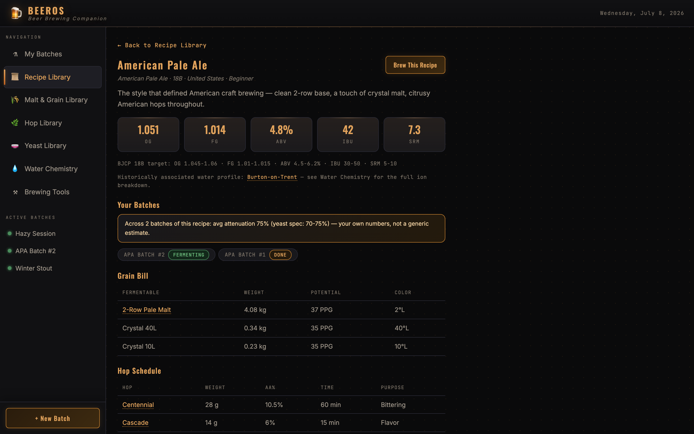
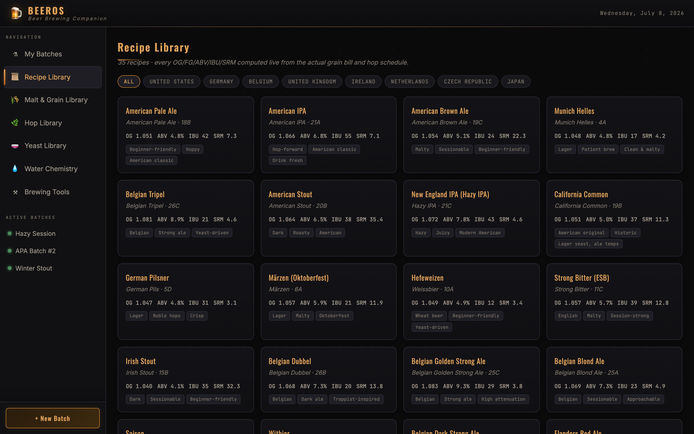
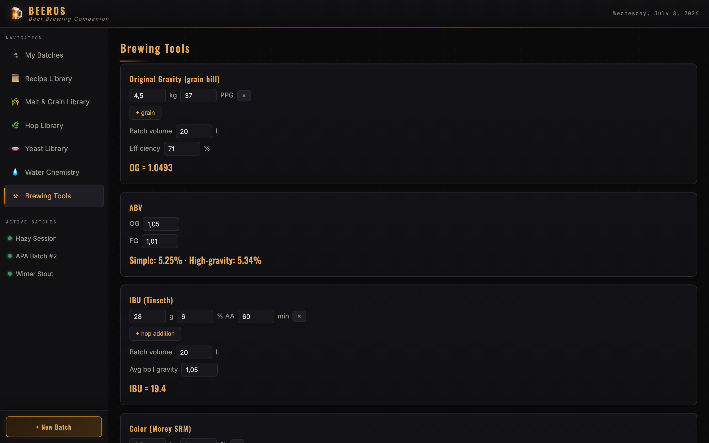
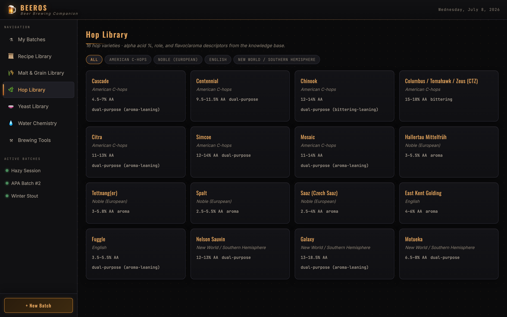
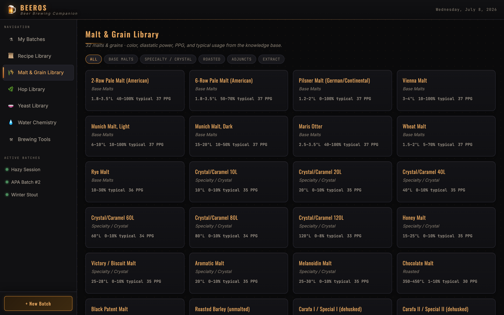
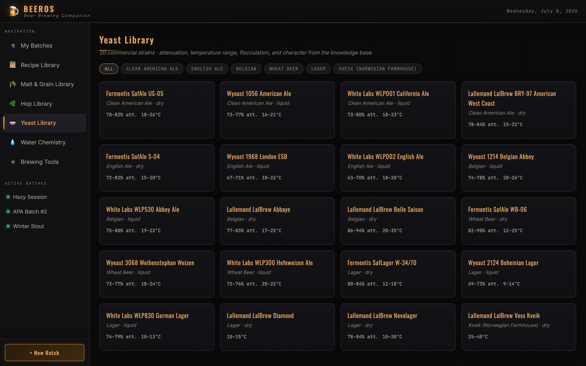
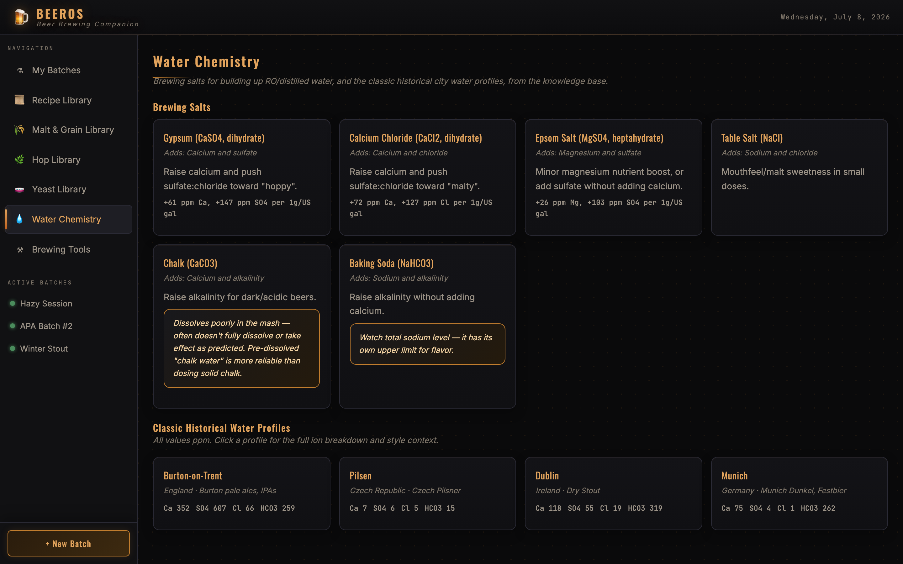

<h1 align="center">🍺 BeerOS</h1>

<p align="center">
  <strong>The companion for home beer brewers.</strong><br>
  Track every batch · <em>reason</em> about fermentation · reference a real ingredient library · design without the maths.
</p>

<p align="center">
  
  
  
  
  
  
</p>

<p align="center">
  <a href="#-quick-start">Quick start</a> ·
  <a href="#-what-you-get">Features</a> ·
  <a href="#-a-look-around">Screenshots</a> ·
  <a href="#-faq">FAQ</a> ·
  <a href="#-licence">Licence</a>
</p>



---

Most brewing apps are a logbook — *"here's the number you typed in."* BeerOS goes a step further: a rule-based **Advisor** reads your actual gravity trend, your recipe's own yeast spec, and your own brewing history, and tells you **what's happening and what to do next** — while still being a genuinely useful place to track batches, browse a real ingredient library, and run the calculators every brew day needs.

It runs on hardware **you** control and stores your data locally — **no cloud account, no subscription, no package manager, no Node.js, no database server.** Open it from any computer, phone or tablet on your home network.

---

## ✨ What you get

**🧭 An Advisor that reasons, not just a log**
Every batch gets read against the recipe's own yeast attenuation range — "looks done fermenting," "possible stall" — and once you've hooked up a real hydrometer sensor, a stall or slow ferment gets a **temperature explanation for free**: *"Your recent temperature readings have been around 14.5°C, below this recipe's 18-20°C range — this could be contributing to the slowdown."* It's the median of the last few sensor readings, not a single point, so a fridge compressor cycling for one reading doesn't cause a false alarm. While nothing's wrong, it says so — a forward-looking **"on track, done in about N days"** reusing the same linear projection shown in the stat row. And once you've brewed a recipe more than once, it compares **this batch's pace against your own average** for that exact recipe, not a generic textbook range — *"Slower than your usual pace for this recipe."* One rule, not ten: personal history replaces the generic check when it applies, rather than piling a second card on top. Deterministic throughout — a transparent rule engine over your own data, no LLM in the loop, every insight citing the real number it's reasoning from.

**📊 Batches remember what happened last time**
Every recipe page shows **Your Batches** — every batch you've actually brewed from it, plus a plain average of your own attenuation and days-to-fermentation-complete once you have two or more to average. Open a new batch of a recipe you've brewed before and it shows **Compared to Last Time**: OG, current/final SG, attenuation, days, and your own notes, this batch side by side with the most recent other one — right when you're mid-brew and might actually want the comparison, not buried in a history tab.

**🧫 Batches tracked by reality**
Log gravity manually, or point an **iSpindel/GravityMon** at BeerOS directly, or anything that can target a **"Brewfather Custom Stream"**-compatible URL — Tilt, RAPT, or Plaato via their existing bridge apps — and readings land in the log automatically. A per-recipe **step checklist** (brew day → fermentation checks → dry hop / diacetyl rest / lagering → packaging) is generated from the recipe's own grain bill, hop schedule, and yeast, so it can never drift out of sync with the recipe. Batch status follows your checked steps and gravity trend automatically, with a one-click manual override. Search, filter, sort, paginate, export to CSV. Each batch gets an **animated SVG fermenter/keg** — liquid tint from the recipe's real computed SRM, rising bubbles and krausen while fermenting, settling particles while conditioning, a kegged-and-capped icon when done.

**📜 35 recipes you can brew directly**
20 original US/European/Belgian styles plus 15 homebrew-clone-inspired takes on real commercial beers, built from each beer's published ABV/style rather than proprietary formulas. Every OG/FG/ABV/IBU/SRM is computed **live** from the actual grain bill and hop schedule and checked against real BJCP 2021 ranges — nothing is a hand-typed number. "Brew This Recipe" starts a tracked batch directly from any recipe.

**📚 Reference libraries that cross-link to your recipes**
Browsable views for 32 malts/grains, 16 hop varieties, 20 yeast strains, and water chemistry (6 brewing salts + 4 classic historical city water profiles). Every entry cross-links to the recipes that use it, and back — a miss just shows plain text rather than risking a wrong link, so coverage grows as the libraries do without needing new code.

**🧮 Calculators with a cited spec behind them**
OG (grain bill), ABV (standard + high-gravity), IBU (Tinseth), colour (Morey SRM/EBC), strike water temperature, priming sugar, force carbonation (kegging — pressure/temp/CO₂-volumes, interpolated over a real reference table rather than trusting an unverifiable formula), residual alkalinity, yeast pitch rate, refractometer FG correction, and brewhouse efficiency. Every formula is unit-tested against the Knowledge Base's worked examples.

**📖 A ~78,000-word Knowledge Base**
Source-cited reference on ingredients, equipment, process, troubleshooting, recipe design, and every calculator's underlying math — written for brewers from complete beginners to all-grain veterans. It's also the spec the calculator code is verified against, in [`docs/knowledge-base/`](docs/knowledge-base/).

---

## 📸 A look around

| My Batches — Advisor's Continue Brewing panel | Batch detail — Advisor, personal history, comparison |
|---|---|
|  |  |

| Recipe detail — live stats, ingredient links, your history | Recipe Library |
|---|---|
|  |  |

<details>
<summary>More screenshots</summary>

| Brewing Tools & calculators | Hop Library |
|---|---|
|  |  |

| Malt & Grain Library | Yeast Library |
|---|---|
|  |  |

| Water Chemistry |
|---|
|  |

</details>

---

## 🚀 Quick start

You need only **Python 3.8+** — no pip installs, no build step, no Node.

```sh
git clone https://github.com/icemanxbe/BeerOS.git
cd BeerOS
python3 server.py
```

Open **http://localhost:8199** — that's the whole setup. Anyone on your network can open `http://<your-machine-ip>:8199` and works with the same shared data.

```sh
python3 server.py --port 9000            # a different port
python3 server.py --db /path/beeros.db   # a different database location
```

The server is Python **standard library only** — it serves the app as static files plus a tiny `GET/POST /api/state` JSON-blob API backed by SQLite, and a `POST /api/telemetry` webhook for hydrometer sensors. Single shared instance, no multi-user auth — add that complexity if/when a second brewer or device actually needs it.

Run the test suites:
```sh
node core/domain/calculators.test.js      # calculator functions vs. the KB's worked examples
node core/domain/advisor.test.js          # Advisor insight rules
node core/domain/ingredient-links.test.js # recipe <-> ingredient/water cross-linking, vs. real data
node core/domain/recipe-history.test.js   # per-recipe personal-average aggregation
node core/data/recipes.verify.js          # every recipe's stats vs. real BJCP ranges
python3 server.test.py                    # telemetry webhook normalization (iSpindel/Brewfather shapes)
```

---

## ❓ FAQ

**Is it free? Can I sell it?**
Free to use, modify and share for any **noncommercial** purpose. Selling it or using it for commercial advantage is not permitted — see the [licence](#-licence).

**What do I need to install?**
Just Python 3.8+. No packages, no Node, no build step, no separate database.

**Is the Advisor "AI"?**
No — it's a transparent, deterministic rule engine over your own batch data. Every insight cites the real number it's reasoning from — gravity trend, the recipe's own yeast attenuation range, a sensor's actual temperature reading, or your own past batches of that recipe. No LLM in the loop, no fabricated confidence score.

**Where's my data, and how do I back it up?**
Everything is in one file — `beeros.db` by default. Copy it any time, safe even while the server is running.

**Will updating wipe my batches?**
No. `git pull` updates the app files only; your database file is untouched.

**Do I need a hydrometer sensor to use it?**
No — log gravity manually and everything works. A sensor (iSpindel, GravityMon, or Tilt/RAPT/Plaato via a bridge app) just means readings land automatically, and unlocks the Advisor's temperature-aware evidence.

---

## 🗂 Project layout

```
BeerOS/
├── index.html                # app shell (loads app.css + core/*.js, in order)
├── app.css                   # styles
├── core/
│   ├── data/                 # malts, hops, yeasts, water profiles, the 35 recipes
│   ├── state/                # app state, batch persistence, telemetry merge
│   ├── domain/                # calculators, Advisor (rules over real data), recipe-history, ingredient cross-linking
│   └── views/                 # page renderers (batches, recipes, libraries, brewing tools)
├── server.py                  # zero-dependency Python server + SQLite storage + telemetry webhook
├── docs/
│   ├── knowledge-base/        # the ~78,000-word source-cited reference
│   └── screenshots/
└── *.test.js / recipes.verify.js / server.test.py   # test suites, next to the code they verify
```

---

## 📜 Licence

[**PolyForm Noncommercial License 1.0.0**](LICENSE) — free to use, modify and share for any **noncommercial** purpose (personal, hobby, research, nonprofit/education). **Selling it or using it for commercial advantage is not permitted.**

<p align="center"><sub>Brewed with patience. 🍺</sub></p>
